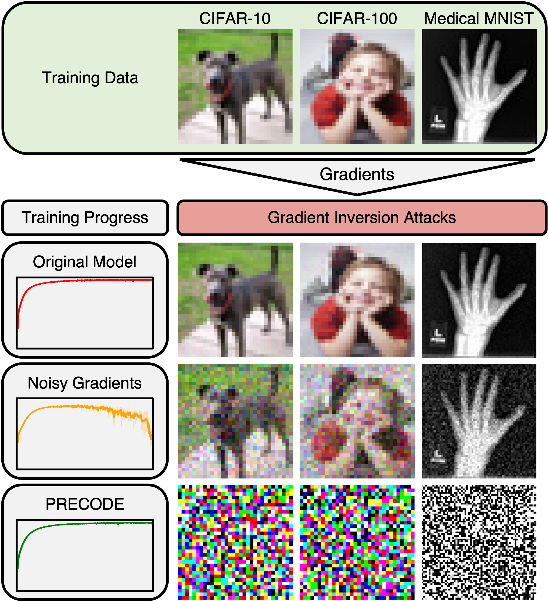

# PRECODE - A Generic Model Extension to Prevent Deep Gradient Leakage



This repository contains the implementation of PRECODE realized as a variational bottleneck as well as an example jupyter notebook where the PRECODE module is used.
The paper can be found at: https://arxiv.org/abs/2108.04725

```
@article{scheliga2021precode,
  title={PRECODE-A Generic Model Extension to Prevent Deep Gradient Leakage},
  author={Scheliga, Daniel and M{\"a}der, Patrick and Seeland, Marco},
  journal={arXiv preprint arXiv:2108.04725},
  year={2021}
}
```

## Abstract:
Collaborative training of neural networks leverages distributed data by exchanging gradient information between different clients. Although training data entirely resides with the clients, recent work shows that training data can be reconstructed from such exchanged gradient information. To enhance privacy, gradient perturbation techniques have been proposed. However, they come at the cost of reduced model performance, increased convergence time, or increased data demand. In this paper, we introduce PRECODE, a PRivacy EnhanCing mODulE that can be used as generic extension for arbitrary model architectures. We propose a simple yet effective realization of PRECODE using variational modeling. The stochastic sampling induced by variational modeling effectively prevents privacy leakage from gradients and in turn preserves privacy of data owners. We evaluate PRECODE using state of the art gradient inversion attacks on two different model architectures trained on three datasets. In contrast to commonly used defense mechanisms, we find that our proposed modification consistently reduces the attack success rate to 0% while having almost no negative impact on model training and final performance. As a result, PRECODE reveals a promising path towards privacy enhancing model extensions.


## Requirements:
+ pytorch
+ torchvision
+ scikit-image

You can also use [conda](https://www.anaconda.com/) to recreate our virtual environment:
```
conda env create -f environment.yaml
conda activate precode
```

## Credits:
We use the attack of Geiping et al. ([arXiv](https://arxiv.org/abs/2003.14053), [GitHub](https://github.com/JonasGeiping/invertinggradients)).

The implementation of the variational bottleneck is mainly inspired by 1Konny's implementation of a Deep Variational Information Bottleneck ([GitHub](https://github.com/1Konny/VIB-pytorch))
